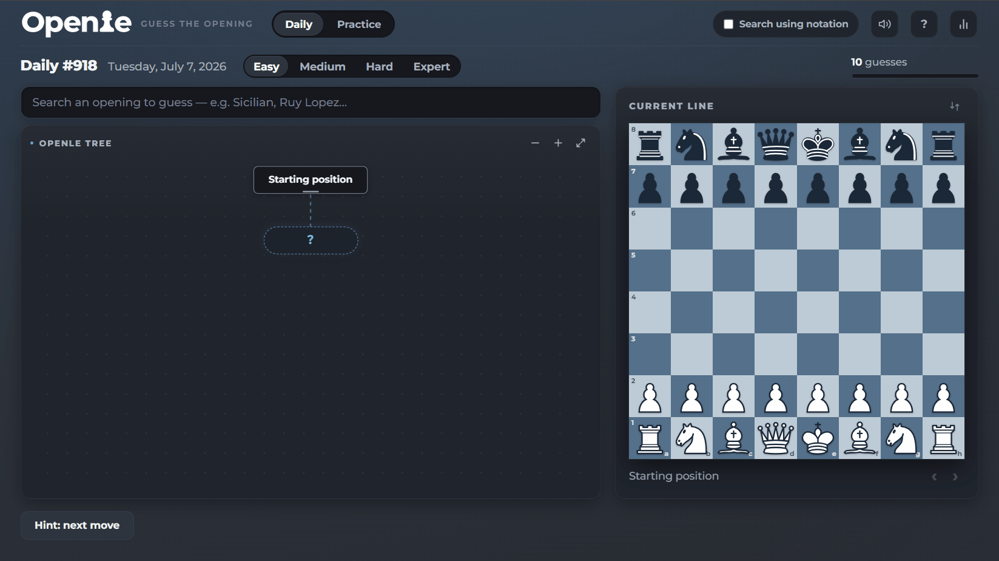

# Openle

[](https://github.com/petroskoukios/Openle-Daily/actions/workflows/ci.yml)

### ▶ Play it live: **[openledaily.com](https://openledaily.com)**

Guess the chess opening. A daily puzzle game in the spirit of Wordle and Metazooa,
but for **chess openings**.



Each day a hidden **target opening** is chosen. You guess other openings, and the
only feedback is how far you travel down the **same branches of the opening tree**
before your line splits away from the target's. The goal is to feel like you're
*navigating the opening tree*, gradually learning how openings relate to one another.

## Engineering highlights

Built as a **zero-dependency static site** — vanilla ES modules, plain CSS, no
framework and no build step — deployed as flat files. The parts I'm most proud of:

- **Custom opening-tree layout** (`js/tree.js`) — a from-scratch tidy-tree layout for
  variable-width boxes: staggered sibling lanes, contour-based horizontal packing so
  deep branches tuck under shallow neighbours, adaptive spacing that opens up wide fans,
  and edge routing that threads the gaps instead of cutting through boxes. Rendered as
  hand-built SVG with pan/zoom, no graph library.
- **Hand-written SAN chess engine** (`chess.js`) — replays algebraic move lists to
  reconstruct any board position, so the board can show exactly how deep a guess matched.
- **Deterministic daily puzzles** (`js/daily.js`) — the same puzzle for everyone
  worldwide, per tier, from a seeded shuffle (`xmur3` + `mulberry32`) keyed to the UTC
  date. No backend, no database — the calendar *is* the server.
- **Difficulty modelling** (`openings.js`, `js/data.js`) — 569 hand-curated openings
  across five tiers, with exclusive *target* pools (what the answer can be) layered over
  cumulative *guess* pools (what you're allowed to guess).
- **Dependency-free test harness** (`tests.html`) — loads the real app in an iframe and
  runs 100+ assertions over the SAN engine, daily selection, comparison/budget rules,
  and layout invariants; runs headless in CI on every push via Playwright.

## How it plays

- **Four daily puzzles every day** — one per difficulty (Easy / Medium / Hard /
  Expert). Each is chosen deterministically from the calendar date, so it's the same
  for everyone playing that tier. Switch tiers freely; each keeps its own progress.
- **Difficulty-specific guess budgets**: Easy gets 10 guesses, Medium 15, Hard 20,
  and Expert 25. Guesses are selected through an autocomplete search, so you don't
  need to type exact names (`najdorf` is enough). A persistent **Search using
  notation** toggle enables move-order search (`1. e4 e5 Nf3`). Already submitted
  openings are removed from both kinds of search.
- **Hints reveal one more target move** on the tree and board, and each hint costs
  **3 guesses** from that tier's budget.
- For every guess the game finds the **deepest common prefix of moves** with the
  target — the point where your line splits away from the target's.
- The feedback is the **opening tree itself** — that's the whole game. Confirmed-shared
  moves form a blue trunk; each guess's wrong turn branches off in gray; the tip of the
  trunk shows how deep you've confirmed. The target path turns gold ★ only when you
  solve it; revealed-but-unsolved answers stay blue in the tree.
- The tree can be panned, zoomed, and opened in a fullscreen view. Selecting a move
  in the tree replays that position on the board.
- A minimal **guess log** under the tree shows each guess's line with shared moves in
  blue and the diverging move in gray — nothing else to read.
- A **chess board** beside the tree shows *how far you've gotten* — the position at the
  end of the deepest line you've confirmed shared with the target (the full target
  position once the puzzle ends). The position is rebuilt from the moves by a small
  built-in SAN engine and can be replayed with the on-screen controls or left/right
  arrow keys.
- **Shareable results** — a clean, spoiler-free one-liner with the puzzle number,
  difficulty, and guesses used, plus a link back to the game.
- **Practice mode** — endless random openings at any difficulty, with its own
  per-tier statistics.
- **Custom puzzles** — pick any starting opening and the puzzle is built from its own
  variations, so you can drill a specific part of the tree.

## Running it

It's a fully static site — no build step and no package install.

Serve the repository with any static HTTP server. For example:

```bash
python -m http.server 8765
# then open http://127.0.0.1:8765
```

The local server is required because the game uses native JavaScript modules. Opening
`index.html` directly from `file://` is blocked by module security rules in most
browsers. Clipboard access can also vary by browser; when it is unavailable, the game
falls back to a copy prompt.

## Project layout

| Path | Purpose |
| --- | --- |
| `index.html` | Application markup, controls, and modals; loads the data, SAN engine, and module entry point. |
| `styles.css` | All application, board, tree, responsive, and modal styling. |
| `openings.js` | Curated opening database (`window.OPENINGS`) and tier assignments. |
| `chess.js` | Small SAN engine that replays moves to reconstruct board positions. |
| `js/main.js` | Module entry point, event wiring, boot, and the `window.__OT` test hook. |
| `js/data.js` | Normalizes opening records and builds the cumulative difficulty pools. |
| `js/state.js` | Current game state plus daily-progress and preference persistence. |
| `js/domain.js` | Guess comparison, confirmed-depth logic, and guess/hint budget math. |
| `js/daily.js` | Deterministic per-difficulty daily rotation. |
| `js/actions.js` | Guess submission, hints, give-up, and end-of-game handling. |
| `js/search.js` | Name and optional move-order autocomplete. |
| `js/tree.js` | Opening-tree layout, rendering, selection, pan/zoom, and fullscreen behavior. |
| `js/tree-inspector.js` | Fullscreen-tree opening inspector (selected-line detail panel). |
| `js/custom-tree.js` | Custom-tree state: openings added to your own tree for exploration. |
| `js/board.js`, `js/board-view.js` | Board rendering, playback, navigation, and view-state resolution. |
| `js/render.js`, `js/history.js` | Main UI render pass and guess-history rendering. |
| `js/stats.js`, `js/share.js` | Per-mode/per-tier statistics, win flow, and share text. |
| `js/format.js`, `js/dom.js` | Shared formatting and DOM helpers. |
| `tests.html` | Dependency-free browser test harness for the SAN engine and game core. |
| `assets/`, `pieces-svg/` | Logos and CC BY-SA chess-piece artwork. |

## Testing

With the local server running, open
[`http://127.0.0.1:8765/tests.html`](http://127.0.0.1:8765/tests.html). The harness
loads the real app in an iframe and tests the SAN engine, opening data, daily
selection, comparison and budget rules, search helpers, and board-view logic. Results
are displayed in the page and written to the browser console.

### Headless / CI

The same harness runs headlessly via Playwright, and on every push/PR through
[GitHub Actions](.github/workflows/ci.yml):

```bash
npm install
npx playwright install chromium   # first time only
npm test
```

`npm test` serves the repo, opens `tests.html` in headless Chromium, waits for the
suite to finish, and exits non-zero if any test fails.

There is no separate build, test runner, or package-manager command.

## The data

The source dataset contains 3,167 uniquely-named openings and variations. Openle
retains a curated set of **569 recognizable openings** with their ECO codes and full
main-line move sequences, derived from the open
[lichess-org/chess-openings](https://github.com/lichess-org/chess-openings) dataset
(CC0). Deep catalog branches, novelty gambits, and structurally obscure sidelines are
excluded from the shipped database. Each retained opening stores its name, ECO code,
SAN move sequence, and an opening family derived from the name.

### Difficulty

The dataset has no popularity/frequency signal, so the retained openings were reviewed
manually for recognizability and theoretical difficulty. Each tier has two pools:

- **Target pool (exclusive)** — what the puzzle's answer can be. A tier's answer is
  drawn only from that tier: **Easy 32 · Medium 50 · Hard 130 · Expert 261**. An Easy
  answer is never a Hard opening, and vice versa.
- **Guess / autocomplete pool (cumulative)** — what you're allowed to guess. Each tier
  includes its own targets plus every easier tier's, so lower-difficulty openings still
  show up as valid guesses: **Easy 39 · Medium 89 · Hard 219 · Expert 480**.

A small **starter** tier of 7 super-fundamental openings (the basic king/queen pawn
games, Queen's Gambit, Indian Defense, English, …) sits below Easy. These are
guessable in *every* tier but are never the answer and are not a playable mode — they
exist so the foundational lines are always available as guesses.

The `tier` metadata in `openings.js` is the source of truth: starter 7, Easy 32,
Medium 50, Hard 130, Expert 261, and the remaining 89 entries are marked `reserve`
(excluded from both targets and autocomplete) — 569 in total.

## Credits

- **Opening data**: [lichess-org/chess-openings](https://github.com/lichess-org/chess-openings) (CC0).
- **Chess piece graphics** (`pieces-svg/`): by Uray M. János, derived from the Wikipedia
  ["Cburnett" set](https://en.wikipedia.org/wiki/File:Chess_klt45.svg) — licensed
  [CC BY-SA](https://creativecommons.org/licenses/by-sa/3.0/). The attribution comments
  inside each SVG are preserved, and any redistribution of the graphics stays under CC BY-SA.

## License

Copyright (C) 2026 Petros Efraim Koukios.

The application code is released under the
[GNU Affero General Public License v3.0](LICENSE) (AGPL-3.0). You're free to use,
study, and modify it, but any modified version you distribute **or run as a hosted
service** must make its complete source available under the same license.

The bundled chess piece graphics (`pieces-svg/`) remain under CC BY-SA as noted above,
and the opening data derives from a CC0 source — see [Credits](#credits).
